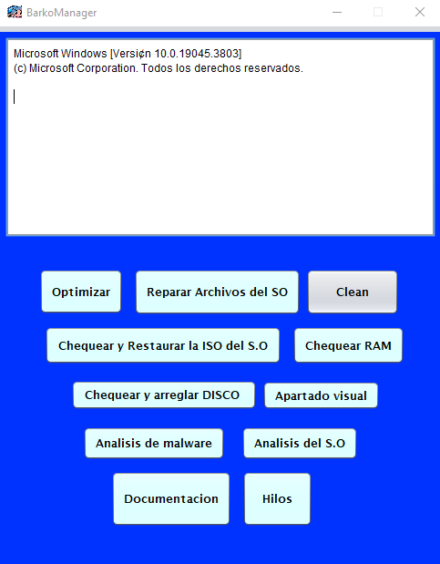

### I'm Brayan Barco 👋

### Habilidades 🛠️

      

### Proyectos Destacados 💻

**[BarkoManager](https://github.com/Barcodehub/BarkoManager)** - Aplicación práctica de administración de rendimiento y un ejemplo educativo que demuestra el uso de la concurrencia y los hilos en Java a través de una simulación gráfica de un restaurante.

**[BarkoManager](https://github.com/angeldev07/semilleros-front)** - Repositorio dedicado al frontend del proyecto semilleros UFPS.

**[Nombre Proyecto 2](https://github.com/Barcodehub/biblioproject)** - Aplicación web de gestión de libros de biblioteca con implementación de Inteligencia Artificial en la elaboración de un chatbot funcional.

### Estadísticas de GitHub 📊

### Contáctame 📫

   &nbsp; &nbsp;
  

⭐️ From [Brayan Alexander Barco](https://github.com/Barcodehub)
